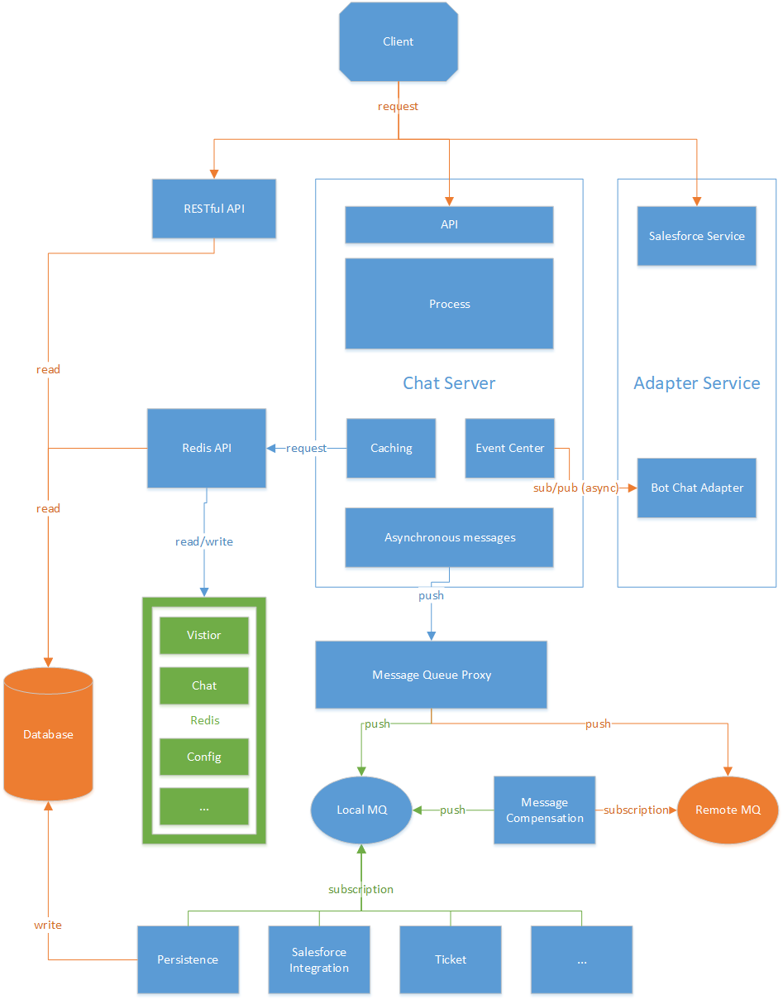

# chat server 解耦

## 现有状况

目前ChatServer作为LiveChat的核心模块，为访客端和客服端提供服务，处理聊天的业务，机器人服务对接，集成其他产品等多项业务。在这样的状况下，问题也比较明显，Chatsever作为各种业务耦合的一个单一应用，目前产品功能版本如果涉及到一部分局部功能的变动，也需要进行Chatserver的修改和测试，这里会有多个风险:
1.  项目周期长；
2.	回归测试不完备；
3.	Chatserver涉及的逻辑多，开发人员难以维护；
4.	Chatserver本身的负载高，

## 架构目标

1.	让Chatserver成为一个无状态(状态转移到Redis中供各个程序共享的应用，支持负载均衡
2.	将Chatserver中的异步操作

## 总体思路

1.	使用Redis作为数据存储服务器, 将原来ChatServer内存中的数据放到Redis中, 使Chat Server应用可以支持负载均衡, 可以快速重启

  
 
2.	使用消息队列解耦Chat Server中的一部分异步操作
3.	将Chat Server模块根据业务进行拆分,   将访客/聊天等核心模块与其他非核心模块分离, 保证核心模块可以在没有数据库的状态下运行, 使得在数据库升级过程中可以使用

## 总体架构 

  

### 模块说明

#### Chat Server 
Chat Server应用程序分5个模块: API, Process, Caching, EventCenter, Asynchronous Messages
1. API
  - 提供Visitor, Agent, Chat  的接口
2. Process
  - 处理Visitor, Agent, Chat的请求
3. Caching
  - 缓存服务器中的状态, 并且与进程外的状态服务器(Redis)沟通
4. EventCenter
  - 注册/分发ChatServer中的事件
5. Asynchronous Messages
  - ChatServer中产生的可以异步执行的消息, 发到消息队列中

#### Adapater Service

支撑Chat Server功能的其他一些服务，主要是访问第三方服务, 处理返回
1. Salesforce Service
  - salesforce相关功能的一些服务, 由客户端调用
2. Bot Chat Adapter
  - bot相关的功能, 监听ChatServer中的一些事件, 响应事件以后调用bot api, 返回结果插入到聊天消息中

#### MQ Proxy

消息队列的代理服务, 可以将消息插入到本地的消息队列服务器中, 在本地消息队列不可用时插入到远程消息队列服务器中

1. Message compensation
  - 消息的补偿服务, 主要是拉取远程的消息队列服务器，插入到本地的消息队列中

2. Subscription Service
  - 消费消息的服务, 做一些异步操作， 主要为持久化, 第三方集成等

#### Redis API

这是以Redis 为代表的进程外状态服务器, 在系统中为可插拔状态, 即Caching模块可以不使用进程外的状态服务器而使用进程内的内存来管理状态

## 应用发布升级
 
### 应用发布升级根据发布影响的范围分为三个级别的发布

1. 只修改逻辑, 可以在线回滚
  - 直接覆盖发布应用程序
2. 修改逻辑, 存储的数据, 可以在线回滚(Redis数据没有删除字段, 数据库没有删除/修改字段, 只回滚程序, 不回滚数据库)
  - 使用Loadbalance切换流量到一个Server, 升级另一个Server, 然后再切回来升级
3. 修改/删除了数据库字段，不能兼容老的应用程序
  - 采用maximumOn切换到副服务器发布

### Redis数据变更影响

修改Redis数据对象，对象采用hash类型， 新程序对对象做如下变更
  1.	增加对象 – 可以同时兼容新老程序，只需要修改用到这个字段的模块
  2.	对象增加字段 – 可以同时兼容新老程序， 只需要修改用到这个字段的模块
    - 新程序模块读取老程序模块保存的对象，在反序列化时为新字段添加默认值
    - 老程序模块读取新程序模块保存的对象，反序列化的时候会忽略新添加的字段
    - 老程序模块修改新程序模块保存的对象，只会修改自己定义的那些字段，不会修改添加的字段
    - 新程序模块修改老程序模块保存的对象，完整保存新的对象
  3.	修改基本数据类型的字段, 因为实际存储都是以string来存储, 因为在类型转化没有问题的前提下可以完全兼容新老版本，需要修改用到这个字段的模块
  4.	修改对象类型的字段(增加属性)，因为针对这种类型是通过json存储, 应此需要将使用到这个对象的所有模块同步修改
  - 新程序访问老程序的数据，在反序列化时添加默认值
  5.	删除对象的字段，因为删除上一个版本在使用的字段可能导致程序回滚失败, 因此只能删除已经确定不用的，在这种情况下也可以同时支持新老程序

