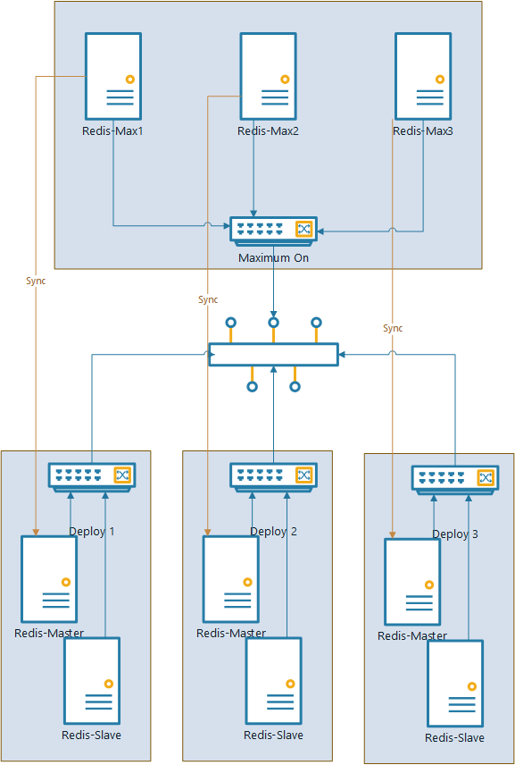

# Chat Server 重构
## Chat Server现有状况

1. ChatServer不支持Loadbalance, 不支持服务拓展
2. 单点ChatServer不能宕机, 无法满足运维经常要打补丁的需求
3. Chatserver本身的负载高, 同步的IO操作影响服务器吞吐量
4. Chatserver锁颗粒度比较高, 写锁比较多, 整体的读并发度也上不去, 对于大站点的响应会比较慢
5. MaxOn功能不完备, 而且维护和测试成本比较高
6. ChatServer与第三方产品（Salesforce,bot）集成的耦合度比较高, 维护和测试成本高
7. ChatServer的运行严重依赖于数据库, 但是目前的数据库较大, 维护成本很高, 重启需要很长时间, 在保证可用性的前提下无法对数据库进行大的操作

## 架构目标

1. ChatServer 支持负载均衡
  - 使用进程外的状态服务

2. 降低ChatServer对数据库的依赖, 使Chat Server可以无数据库运行
  - 配置数据使用缓存, Chat Server直接访问缓存
  - 写记录使用消息队列

  + 限于实际情况, 目前版本保证用户聊天业务能够正常进行, 因此以下的功能在无数据库状态下不能支持:
    - Agent Console查看历史
    - Control Panel修改配置信息, 查看报表等
    - Agent Console中处理Ticket/Social
    - Report API
    - Restful API
3. 将ChatServer中的同步操作改为异步操作, 部分可延迟处理的操作采用消息队列解耦, 降低ChatServer负载
4. 提高ChatServer的稳定性和并发度
5. 将ChatServer中的第三方(Salesforce, Bot)操作拆除来, 做成独立的应用, 降低这部分耦合度
6. 采用Redis自带的拷贝方案, 使得配置数据可以直接到副服务器的Redis服务中, 降低MaximumOn的维护成本

## 拓扑结构

1. 在MaxOn功能基础上, 部署分为主服务器, 以及备用服务器, 异地跨机房部署
2. 主服务器上的各个主机在一个局域网内
  - 多套Web Server做Load-balance, 内部做NLB, 对外公开一个Cluster IP
  - Redis Server在本地做master-slave部署
    - 当Master宕掉以后系统可以自动切换到使用Slave
  - 本地有一个MQ Server可以做消息队列管理
  - 本地有一个数据库服务存储数据
3. 副服务器上部署一套程序
  - 部署一套Web应用
  - Redis服务从主服务器的Redis - Master同步数据
    - 配置salve-priority 为0, 这样在master宕机以后他不会被选为master
  - 本地的MQ Server作为副服务器的消息队列管理
4. 远程有一个MQ Service, 可以在本地消息服务失效时使用(MaxOn 主副使用同一个远程的MQ Server)

## ChatSrver架构 

  

### Chat Server 
Chat Server应用程序分3个模块: API, Process, DataAccess
1. API
  - 提供Visitor, Agent, Chat的接口, 做序列化反序列化, 聚合处理结果
2. Process
  - 处理Visitor, Agent, Chat的请求逻辑
3. DataAccess
  - 数据访问层, 对上公开数据的读写操作, 在其之下有可能是访问数据库/内存/StateService/MQ等
    - Caching 
      - 提供缓存数据的访问, 包括配置信息, Visitor, Chat等内容
      - Caching 后面可以是使用Redis这样的缓存服务器, 也可以为进程内的数据

### Adapater Service

支撑Chat Server功能的其他一些服务, 主要是访问第三方服务, 处理返回, 
### 接口都要放到chat-server, 后面通过chatserver调用salesfoce service
1. Salesforce Service
  - salesforce相关功能的一些服务, 由客户端调用
2. Translation Service
  - 聊天自动翻译的功能, 响应ChatServer中的事件调用第三方API, 返回以后更新聊天
3. Bot Chat Adapter
  - Chat中关于Bot的功能, 监听ChatServer中的一些事件, 响应事件以后调用bot api, 返回结果插入到聊天消息中

#### 缓存服务

Chat Server针对不同的部署平台, 可以是纯进程内的内存缓存, 也可以是进程外的其他服务, 如Redis缓存服务。

1. Sync Service
  - 通知机制, Agent在后台更新站点配置数据以后, 需要通知Redis服务实时更新缓存数据
  - 同步逻辑, 通过记录比对RowVersion将数据库中的差量数据读取出来更新到Redis中

2. Redis Service
  - 针对站点配置的缓存数据可以

#### MQ

1. Message compensation
  - 消息的补偿服务, 主要是拉取远程的消息队列服务器, 插入到本地的消息队列中
  - 使用唯一的MessageId防止消息重复插入
    - 消费完以后要保留MessageId, 消费的时候

2. Subscription Service
  - 消费消息的服务, 做一些异步操作
    - 持久化
      - Chat
      - Offline Message
      - Visitor
      - Agent
      - 其他信息
        - Agent状态变更记录
        - Ban
        - Queue Logs
        - 站点访问记录 (5m统计一次)
        - 邀请记录
        - CannedMessage使用记录
        - Conversions
    - Webhook
    - 发邮件
    - Ticket集成
    - Salesforce集成, Zendesk集成

## Load-balance
1. Chat Server应用本身没有状态, 可以部署多套程序指向统一的缓存服务作为进程外的状态服务
2. 在Load-balance控制器中可以直接做active-active的配置
3. 单个Chat Server 应用程序作为Load-balance下面的一个节点可以关机, 使流量导向其他现在可用的节点
4. 多个Chat Server应用访问同一个缓存服务器, 可以使用乐观锁保证事务性

## MaxOn 与 缓存服务
1. MaxOn 副服务器中对应的缓存服务从主服务器的缓存服务中同步
2. 副服务器中的缓存服务开启持久化功能, 使得重启以后数据能够恢复
3. 在副服务器不是active的时候, Chat Server中的时钟停掉, 避免产生重复的消息而产生重复的邮件/Salesforce Case等.
4. 在副服务器切换为active的时候, 停止缓存服务从主服务器的缓存中同步, 避免老数据同步过来
5. 服务器切换过程中, 客户端都需要跟Server进行一次数据同步, 以保证客户端与服务器的状态一致
6. 在One MaxOn的Server上, 副服务器需要对应多个缓存服务
  - 每一个平台在MaximumOnServer上有一个缓存服务, 访问时根据站点找到平台然后对应到具体的缓存服务上

  

## 应用发布升级

### 发布方式

1. 直接发布程序, 应用重启, IIS会处理请求不会因为重启而失败
  - 旧的请求会在旧的程序中处理, 待旧的请求处理完以后, 进程会关掉
  - 新的请求会在新程序启动以后再处理

2. Load-balance切换
  - 将要升级的Server在Load-balance控制器中将流量移掉
    - 在Windows NLB 上测试在Loadbalance下请求的路由
  - 升级这个Server, 待测试通过以后, 将流量导入到升级以后的Server中
  - 待确认升级的Server没有问题以后, 再通过Load-balance将另外的Server再一个一个升级

3. MaximumOn切换
  - 将服务器切换到MaximumOnServer
    - 将主服务器切为不可用, 当前使用副服务器
    - 停止副服务器Redis Server 从主服务器的 Redis(master) Server上同步
    - 将副服务器切为可用
    - 在副服务器上同步聊天数据
      - 切换时, 客户端发送消息同步的命令到server端 (带上本地的最大消息id)
      - Server查找缓存中聊天的最大消息id, 如果不存在该聊天则最大消息id为0
        - 如果Server的消息id比较大, 则将后面的消息返回给客户端, 客户端同步本地消息
        - 如果Server的消息id比较小, 则返回当前server端的最大消息id, 客户端接收到最大消息id以后, 将后面的消息再发送到服务器
        - Server端对接收到的消息有防止重入机制, 避免同样的消息重复插入到聊天中
  - 待切换成功以后, 可以将主服务器做各种升级, 包括程序
  - 主服务器升级以后, 将服务器切换回主服务器
    - 客户端与服务器采用与主切副同样的消息同步机制, 在主服务器中恢复聊天

### 根据变更范围的发布方式

1. Web应用发布, Redis状态无改动
  - 可以直接替换dll发布程序/Loadbalance发布, 取决于部署的平台是有Loadbalance
  - 回滚: 可以直接使用旧的dll进行回滚

2. Web应用发布, Redis状态有改动, 但是新老数据可以同时兼容新老程序
  - 可以直接替换dll发布程序/Loadbalance发布, 取决于部署的平台是有Loadbalance
  - 回滚: 可以直接使用旧的dll回归

3. Web应用发布, Redis状态有改动, 新/老数据可以兼容新程序, 但是新的数据不能兼容老程序
  - 采用MaximumOn切换发布
  - 回滚：因为Redis数据无法回滚, 
  

4. 整个发布, Redis数据不兼容, 即新的程序无法直接访问老的Redis数据
  - 采用MaximumOn发布 
    - 发布过程中需要让副服务器始终跑旧程序, 需要保证切换过程可以做到从新切换到老的
  - 回滚: 采用MaximumOn回滚

5. 数据库升级 
  - 数据库的升级不影响ChatServer发布, 只有程序是否对Redis的兼容性改动才会影响发布方式，但是需要按照一定的流程发布
    - 停止Redis Sync, Portal, Persistence等操作数据库的服务
    - 升级数据库
    - 发布应用程序
    - 启动停掉的程序
  - 回滚:  数据库回滚可以同发布流程

### 运维维护

1. Web Server维护 (有Loadbalance才允许不停服务下维护)
  - 在Loadbalance中将需要维护的服务器流量切掉
  - 对Web Server服务就行维护
  - 启动服务
  - 在Loadbalance中将流量切回来

2. Redis服务维护
  - Master 维护, 需要将Redis切换到Slave, 停掉Redis-Master那台服务, 做维护, 再起来, 配置为从原来的Slave同步, 如果需要将Redis切回来则可以再将Master切回来
  - Slave 维护, 直接停机维护即可

3. 数据库服务维护
  - 需要停止所有跟数据库相关的应用以后再进行维护

4. MQ Server维护
  - 保证远程MQ Server可用的情况下可以对MQ Server做停机维护

5. 整个平台迁移
  - 需要切换到MaximumOn以后再做 平台迁移事宜

## MQ接口

定义MQ的接口供ChatServer使用, 后面的具体实现作为生产者不需要知道, 可以是SQL Server Service Broker, 也可以是RabbitMQ

1. producer
  + publish(queue_name, unique_id, payload)
    - queue_name, 表示消息队列的名字
    - unique_id, 表示消息的id, 采用guid保证全局唯一性
    - body, 表示消息的内容, 使用json格式 
2. consumer
  + create_consumer(thread, queue_name), 返回一个consumer的实例
    + consumer.dequeue(), 返回一个消息
      - unique_id
      - payload
  + ack(queue_name, unique_id), 消息消费确认

### Queue 定义

1. chat_ended
  + queue
    - persistence
    - email
    - ticket
    - webhook
    - salesforce
    - zendesk
    
  + payload
    - `id` - guid
    - `siteId`
    - `visitorId`
    - `sessionId`
    - `ticket`
      - `id`
      - `ifNew`
      - `title`
    - `prechat`
      - `name`
      - `email`
      - `phone`
      - `productService`
      - `department`
    - `wrapup`
      - `comment`
      - `category`
    - `agentIds`
    - `ifEnterQueue`
    - `requestTime`
    - `startTime`
    - `endTime`

1. submit_offline_message
  + queue
    - persistence
    - email
    - ticket
    - webhook
    - salesforce
    - zendesk
  + payload
    - 

## 代码结构

1. API
  - Visitor
  - Chat
  - Agent
    - getAllVisitors
      - getVisitors
      - getRequests
      - getChats
2. Process