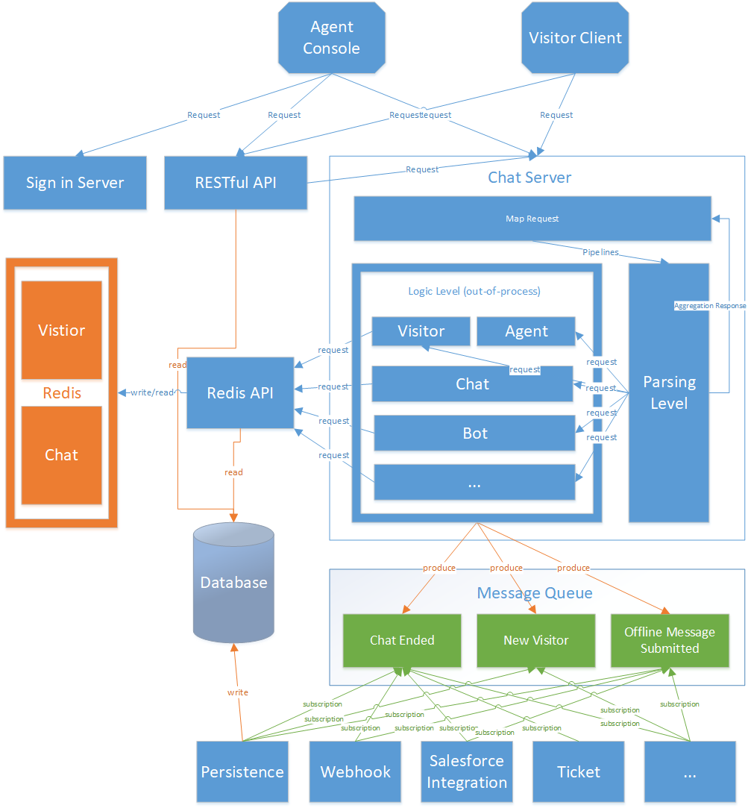
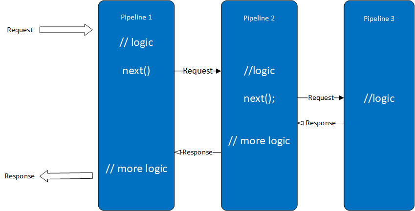

# chat server 解耦

## 现有状况

目前ChatServer作为LiveChat的核心模块，为访客端和客服端提供服务，处理聊天的业务，机器人服务对接，集成其他产品等多项业务。在这样的状况下，问题也比较明显，Chatsever作为各种业务耦合的一个单一应用，目前产品功能版本如果涉及到一部分局部功能的变动，也需要进行Chatserver的修改和测试，这里会有多个风险:
1.  项目周期长；
2.	回归测试不完备；
3.	Chatserver涉及的逻辑多，开发人员难以维护；
4.	Chatserver本身的负载高，

## 架构目标

1.	让Chatserver成为一个无状态(状态转移到Redis中供各个程序共享的应用，支持负载均衡
2.	将Chatserver中各个独立的业务代码拆分出来，成为独立的应用

## 总体思路

1.	使用Redis作为数据存储服务器, 将原来ChatServer内存中的数据放到Redis中, 使Chat Server应用可以支持负载均衡, 可以快速重启

  
 
2.	使用消息队列解耦Chat Server中的一部分异步操作
3.	将Chat Server模块根据业务进行拆分,   将访客/聊天等核心模块与其他非核心模块分离, 保证核心模块可以在没有数据库的状态下运行, 使得在数据库升级过程中可以使用
---
## TODO
  - 数据缓存 
  - ???
---

## 总体架构

  

应用程序分为三层: Map层, 解释层, 逻辑层
1. Map层
  - 一个事件(操作)定义一个到server的地址, 如
    - visitor/new-visitor
    - visitor/request-chat
  - 将一个请求路由到对应的处理流程中

2.	解析层
  - 接收数据, 反序列化请求
  - 执行逻辑业务层中的处理过程
  - 聚合处理结果, 返回结果

3.	逻辑层
  - 分模块处理各自的业务, 进程外的模块， 为单独的应用

## 应用发布升级

### 应用发布升级根据发布影响的范围分为三个级别的发布

1. 只修改逻辑, 可以在线回滚
  - 直接覆盖发布应用程序
2. 修改逻辑, 存储的数据, 可以在线回滚(Redis数据没有删除字段, 数据库没有删除/修改字段, 只回滚程序, 不回滚数据库)
  - 使用Loadbalance切换流量到一个Server, 升级另一个Server, 然后再切回来升级
3. 修改/删除了数据库字段，不能兼容老的应用程序
  - 采用maximumOn切换到副服务器发布

### Redis数据变更影响

修改Redis数据对象，对象采用hash类型， 新程序对对象做如下变更
  1.	增加对象 – 可以同时兼容新老程序，只需要修改用到这个字段的模块
  2.	对象增加字段 – 可以同时兼容新老程序， 只需要修改用到这个字段的模块
    - 新程序模块读取老程序模块保存的对象，在反序列化时为新字段添加默认值
    - 老程序模块读取新程序模块保存的对象，反序列化的时候会忽略新添加的字段
    - 老程序模块修改新程序模块保存的对象，只会修改自己定义的那些字段，不会修改添加的字段
    - 新程序模块修改老程序模块保存的对象，完整保存新的对象
  3.	修改基本数据类型的字段, 因为实际存储都是以string来存储, 因为在类型转化没有问题的前提下可以完全兼容新老版本，需要修改用到这个字段的模块
  4.	修改对象类型的字段(增加属性)，因为针对这种类型是通过json存储, 应此需要将使用到这个对象的所有模块同步修改
  - 新程序访问老程序的数据，在反序列化时添加默认值
  5.	删除对象的字段，因为删除上一个版本在使用的字段可能导致程序回滚失败, 因此只能删除已经确定不用的，在这种情况下也可以同时支持新老程序

## 应用程序配置

  ```json
  {
    "visitor.enter_site": {
        "will": [
          {
            "url": "visitor/check_ban",
          },
          {
            "url": "visitor/check_domain",
          }
        ],
        "do": [
          {
            "url": "visitor/create",
          }
        ],
        "did": [
          {
            "url": "rule/segments",
          }
        ]
    },
    "visitor.page_visitor": {
        "do": [
          {
            "url": "visitor/page_visitor",
          }
        ],
        "did": [
          {
            "url": "rule/segments",
          },
          {
            "url": "rule/dynamic_campaign",
          },
          {
            "url": "visitor/check_domain",
          },
          {
            "url": "rule/route",
          },
          {
            "url": "rule/conversion",
            "type": "async"
          }

        ]
    },
  }
  ```
1. Key: new-visitor/request-chat， 对应一个操作(事件)
2. base: 一个基础的处理过程, 如所有的Agent都需要先做验证，访客端请求或读取visitorGuid之类的操作
3. Pipelines：对应操作(事件)配置不同的具体的处理模块 (Pipeline)
4. 一个处理模块相当于一个pipeline
5. Pipeline的组织形式这里有两种方式
  - 串行执行, 最后将所有的返回结果聚合以后返回
  - 嵌套执行， 嵌套执行时每一个模块的逻辑可以分别在事件执行的前后执行, 结构如下图: 
    
    - 这样可以保证模块的相关逻辑都在本模块执行
    - 每一个模块都可以控制直接结束当前请求
    - 模块下面logic/more logic不依赖于前后后的执行结果，只会根据上下文和redis状态来操作
    - 如果要保证整个执行的一致性，如图中pipeline3中执行失败(抛出异常), 在more logic可以做回滚操作
6.	Pipeline之间的耦合
  - 上下文, 部分请求处理过程中的数据不需要存到Redis中, 则将共享数据放到上下文中, 访问下一个模块时会将上下文合并进去
  - Redis内存服务器中的状态耦合，各个模块都可以修改Redis中的数据
  - 异常, 如果某一个pipeline执行错误, 需要终止整个过程, 可以抛出异常，如果当前pipeline不影响整个执行过程（如salesforce identity）, 则不应该抛出异常
7.	新增一个处理过程, 可以直接在配置文件中增加一个节点
8.	处理过程中新增一个pipeline , 可以直接在上述配置的pipelines列表中增加一项

## 模块划分

从目前ChatServer承担的业务角色角度看， ChatServer可以拆分为以下几个模块

1.	API入口服务
  - Map请求
  - 解析执行Pipeline
  - 聚合结果
2.	访客服务
  - 负责访客的代码下载
  - 负责访客的创建, 以及信息信息维护
  - 负责访客的邀请, 变量及其他与聊天不相关的功能
3.	留言服务
  - 处理留言
4.	Chat服务
  - 处理prechat, social login, sso info 
  - 处理负责聊天的创建, 消息管理，聊天状态管理
  - 处理post chat, wrapup
5.	Rule模块
  - 访客Route计算
  - 访客Segmentation计算
  - 访客Dynamic Campaign
  - 访客Auto Invitation计算
6.	Agent服务
  - 负责Agent登录，登出，状态管理
  - 负责Agent的配置信息管理
7.	聊天分配模块
  - 根据配置分配聊天，可能为agent, bot等
8.	配置服务
  - 负责管理缓存配置数据， 如Campaign, Chat Settings, Department
  - 提供接口给Agent/Visitor端好似用
9.	数据库存储模块
  - 访客记录存储
  - 聊天记录存储
  - Agent状态存储
  - 统计数据存储
10.	Bot Adapter模块
  - 处理跟Bot聊天的消息, 查询Bot API返回消息
11.	API & Webhook模块
  - 提供Chat Server的API供其他模块使用
  - 触发Webhook事件
12.	Salesforce 模块
  - Salesforce Identity
  - 聊天结束后自动创建Leads, Contact等
13.	Zendesk模块
  - 聊天结束后自动创建Ticket
14.	Mobile Push Notification模块
  - iPhone推送服务
  - Android推送服务
  - Agent Console推送服务
15.	Email发送模块
  - 负责相关的邮件发送（聊天，留言）


## Chat Server API

### server.start
  - do
    - register modules
  - will
    - message queue init
    - start timer

### server.end

### visitor.enter_site
  - will 
    - check ban
    - check domain restriction
  - do 
    - create visitor - return visitor_id
  - did
    - calc segments
  
### visiotr.set_custom_variables
  - do
    - update visitor's custom variables
  - did
    - calc segments
    - match conversion - send message to mq
    - calc dynamic campaign
    - calc route
    - trigger bot event

### visitor.page_visit
  - do 
    - update visitor page visit info
  - did
    - calc segments
    - match conversion - send message to mq
    - calc dynamic campaign
    - check domain restriction
    - calc route

### visitor.page_heartbeat
  - do
    - update visitor latest activity time - return (offline/online)

### invitation.check
  - do 
    - check manual invitation - return (none/pop)
    - check auto invitation - return (none/pop/delay pop)

### invitation.show
  - will
    - confirm show invitation (auto)
  - do
    - update visitor state
  - did
    - record invitation log 
  
### invitation.accept
  - did 
    - record invitation log

### invitation.refuse
  - do
    - update visitor state
  - did
    - record invitation log

### prechat.form_submit
  - do 
    - update visitor state
  - did
    - bot 

### prechat.social_login
### prechat.sso_login
### prechat.heartbeat
  - do
    - update visitor state

### prechat.close
  - do 
    - update visitor state


### offline_message.show
  - do 
    - update visitor state

###  offline_message.submit
  - will
    - validating form data
  - do
    - update visitor state
    - send message to mq
      - write to db
      - send email
  - did
    - cacl segments
    - record offline message source (manual invitation)

### offline_message.close
  - did
    - update visitor state

### offline_message.heartbeat
  - do
    - update visitor state

### chat.request
  - will
    - salesforce identity
    - make sure generate visitor & session
  - do
    - create chat - return chat_id
  - did
    - calc route

### chat.start
  - do
    - start timer
  - did
    - send message to mq
      - webhook

### chat.visitor_send_message
  - will
    - check chat state (chat guid)
  - do
    - insert message to chat
  - did
    - auto translation
    - send message to mq
      - webhook

### chat.audio.visitor_request
### chat.audio.visitor_cancel
### chat.audio.visitor_accept
### chat.audio.visitor_refuse
### chat.audio.visitor_stop
### chat.audio.agent_request
### chat.audio.agent_cancel
### chat.audio.agent_accept
### chat.audio.agent_refuse
### chat.audio.agent_stop

### chat.video.visitor_request
### chat.video.visitor_cancel
### chat.video.visitor_accept
### chat.video.visitor_refuse
### chat.video.visitor_stop
### chat.video.agent_request
### chat.video.agent_cancel
### chat.video.agent_accept
### chat.video.agent_refuse
### chat.video.agent_stop

### chat.cobrowsing.agent_request
### chat.cobrowsing.agent_end
### chat.cobrowsing.visitor_accept
### chat.cobrowsing.visitor_refuse
### chat.bot.helpful
### chat.bot.not_helpful
### chat.bot.select_question
### chat.bot.submit_form
### chat.secure_form.agent_request
### chat.secure_form.visitor_get_failure
### chat.secure_form.visitor_submit
### chat.secure_form.visitor_cancel

### chat.visitor_heartbeat
  - do
    - update activity time
    - visitor typing
  - return
    - new messages
    - sent & seen

### chat.visitor_leave
  - will
    - end co-browsing
    - end audie & video 
  - do 
    - insert system message
    - update visitor/agent state
  - did
    - end chat

### chat.post_chat
  - do
    - update visitor state
  - did
    - cacl segments
    - send message to mq
      - write to database

### chat.agent_send_message
  - will
    - check chat state 
  - do
    - insert message to chat
  - did
    - auto translation
    - send message to mq
      - webhook

### chat.agent_accept
### chat.agent_refuse
### chat.agent_join
### chat.agent_monitor
### chat.agent_transfer
### chat.enable_translation 
### chat.disable_translation
### chat.attach_ticket
### chat.salesforce.create_case
### chat.salesforce.create_task
### chat.agent_heartbeat
  - do 
    - update activity time
    - agent typing
  - return 
    - new messages
    - sent & seen 

### chat.wrap_up
### chat.agent_leave
### chat.end
### agent.login
### agent.logout
### agent.set_preference
### agent_chat.send_message
### agent_chat.get_messages

