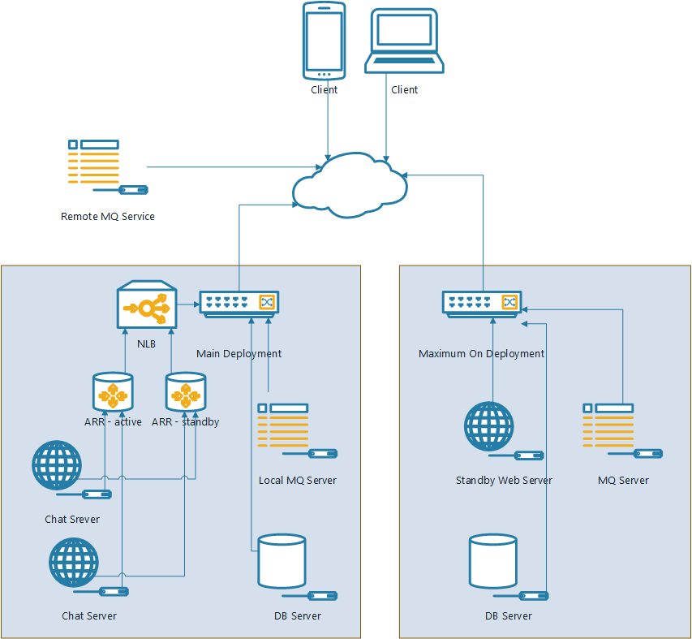
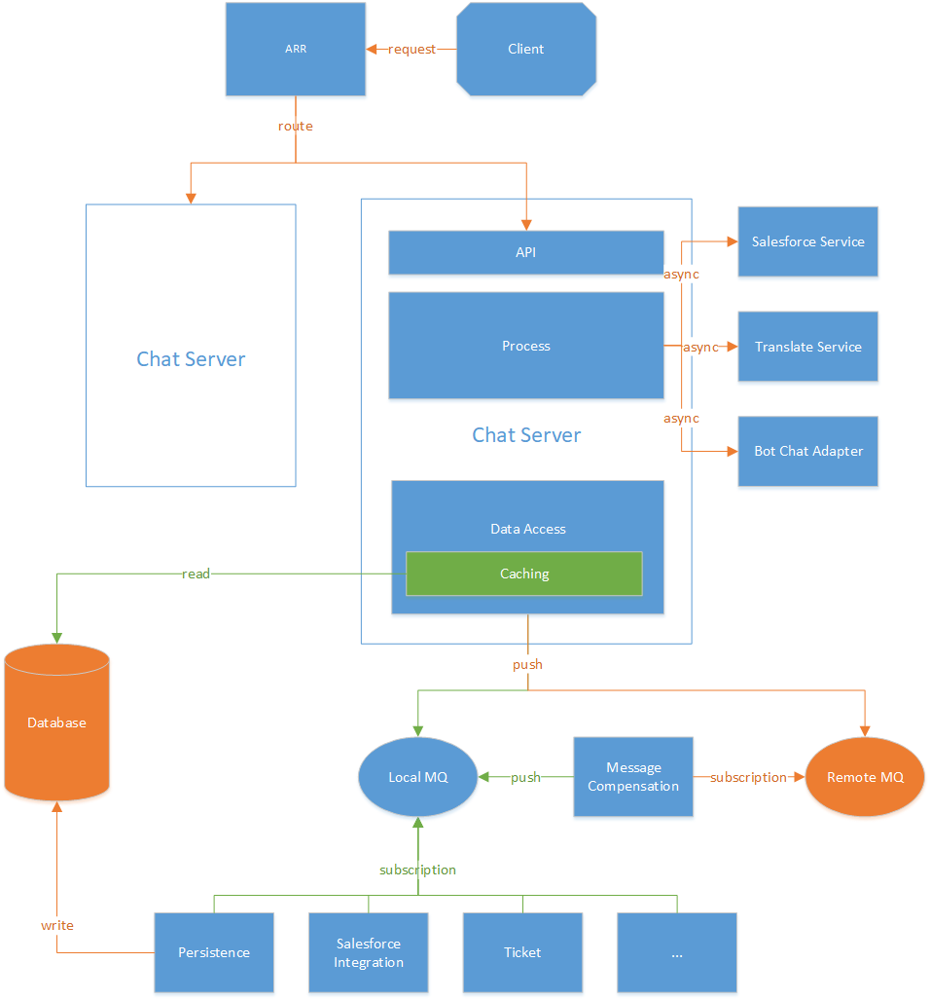

# Chat Server 重构
## Chat Server现有状况

1. ChatServer不支持Loadbalance, 不支持服务拓展
2. 单点ChatServer不能宕机, 无法满足运维经常要打补丁的需求
3. Chatserver本身的负载高, 同步的IO操作影响服务器吞吐量
4. Chatserver锁颗粒度比较高, 写锁比较多, 整体的读并发度也上不去, 对于大站点的响应会比较慢
5. MaxOn功能不完备, 而且维护和测试成本比较高
6. ChatServer与第三方产品（Salesforce,bot）集成的耦合度比较高, 维护和测试成本高
7. ChatServer的运行严重依赖于数据库, 但是目前的数据库较大, 维护成本很高, 重启需要很长时间, 在保证可用性的前提下无法对数据库进行大的操作

## 架构目标

1. ChatServer 支持负载均衡
  - 采用ARR进行站点的分离, 使不同站点的请求分流到不同的节点
2. 降低ChatServer对数据库的依赖, 使Chat Server可以无数据库运行
  - 配置数据使用缓存, Chat Server直接访问缓存
  - 写记录的同时写一条log, Chat Server根据log进行缓存的更新
  - 
  + 限于实际情况, 目前版本保证用户聊天业务能够正常进行, 因此以下的功能在无数据库状态下不能支持:
    - Agent Console查看历史
    - Control Panel修改配置信息, 查看报表等
    - Agent Console中处理Ticket/Social
    - Report API
    - Restful API
3. 将ChatServer中的同步操作改为异步操作, 部分可延迟处理的操作采用消息队列解耦, 降低ChatServer负载
4. 提高ChatServer的稳定性和并发度
5. 将ChatServer中的第三方(Salesforce, Bot)操作拆除来, 做成独立的应用, 降低这部分耦合度
6. 完善MaximumOn功能, 保证切换对用户没有感知

## 拓扑结构

1. 在MaxOn功能基础上, 部署分为主部署, 以及MaximumOn部署, 异地跨机房部署
2. 主部署上的各个主机在一个局域网内
  - 多套Web Server做Load-balance, 使用IIS ARR做load-balance控制器, 根据站点进行分流
  - 多个ARR节点采用NLB做HA, ARR服务对SiteId进行分流, 不同的站点分到对应的Web Server上
  - 本地有一个MQ Server可以做消息队列管理
  - 本地有一个数据库服务存储数据
3. 副部署因为实际使用比较少, 可以只部署一套程序, 不做Loadbalance
  - 部署一套Web应用
  - 部署一个数据库服务, 从主部署中同步配置数据
  - 本地的MQ Server作为副服务器的消息队列管理
4. 远程有一个MQ Service, 可以在本地消息服务失效时使用(主副部署可以使用同一个远程的MQ Server)

## ChatSrver架构 

  

### Chat Server 
Chat Server应用程序分3个模块: API, Process, DataAccess
1. API
  - 提供Visitor, Agent, Chat的接口, 做序列化反序列化, 聚合处理结果
2. Process
  - 处理Visitor, Agent, Chat的请求逻辑
3. DataAccess
  - 数据访问层, 对上公开数据的读写操作, 在其之下有可能是访问数据库/内存/MQ等
    - Caching 
      - 提供静态配置数据的访问, 包括配置信息, 异步从数据库更新数据
      - 提供Visitor, Chat等动态数据的访问

### Adapater Service

支撑Chat Server功能的其他一些服务, 主要是访问第三方服务, 处理返回, 
### 接口都要放到chat-server, 后面通过chatserver调用salesfoce service
1. Salesforce Service
  - salesforce相关功能的一些服务, 由客户端调用
2. Translation Service
  - 聊天自动翻译的功能, 响应ChatServer中的事件调用第三方API, 返回以后更新聊天
3. Bot Chat Adapter
  - Chat中关于Bot的功能, 监听ChatServer中的一些事件, 响应事件以后调用bot api, 返回结果插入到聊天消息中

### MQ

1. Message compensation
  - 消息的补偿服务, 主要是拉取远程的消息队列服务器, 插入到本地的消息队列中
  - 使用唯一的MessageId防止消息重复插入
    - 消费完以后要保留MessageId, 消费的时候

2. Subscription Service
  - 消费消息的服务, 做一些异步操作
    - 持久化
      - Chat
      - Offline Message
      - Visitor
      - Agent
      - 其他信息
        - Agent状态变更记录
        - Ban
        - Queue Logs
        - 站点访问记录 (5m统计一次)
        - 邀请记录
        - CannedMessage使用记录
        - Conversions
    - Webhook
    - 发邮件
    - Ticket集成
    - Salesforce集成, Zendesk集成

### Load-balance
1. 集群中多台ARR服务器采用NLB对外提供统一的访问IP, 
  - NLB配置为active-standby模式, 只有在一台ARR服务器出状况以后才会使用另一台ARR服务器
2. Load-balance控制器(ARR)监控集群中的所有服务, 能够知道所有机器的服务状态
3. Load-balance控制器采用相同的逻辑进行路由, 使得请求不管是到哪一台Load-balance控制器最后的路由结果都是一致的
  - 在添加节点时需要手工修改路由的计算逻辑参数
  - 在节点出问题以后会采用同样的分流逻辑来计算, 即将原来分到这个节点上的请求按照一定的逻辑均分到其他可用的节点
  - 在节点恢复以后, 再将原来是该节点的请求重新分配到该节点
  - 不在列表配置列表中的则按照特定的分流逻辑来计算(如取模)
4. 单个Chat Server 应用程序作为Load-balance下面的一个节点可以关机, 使流量导向其他现在可用的节点
  - 在某一个Site从一个节点切到另一个节点时, 客户端应该在新的节点恢复聊天/访客信息
5. 多个Chat Server产生的消息需要做去重(如chatEnded事件对于同一个id只会处理一次)

## 应用发布升级

### 发布方式

1. 不宕机发布
  - 发布新的chat server core, 修改配置信息

2. Load-balance切换
  - 将要升级的Server直接关掉, Loadbalance 会知道这台Server已经不能服务, 将该站点的请求转到另一节点上
  - 升级这个Server, 待测试通过以后, 将流量导入回升级以后的Server中
  - 待确认升级的Server没有问题以后, 再通过Load-balance将另外的Server再一个一个升级

3. MaximumOn切换
  - 将服务器切换到MaximumOnServer
    - 将主服务器切为不可用, 当前使用副服务器
    - 将副服务器切为可用
    - 在副服务器上同步聊天数据
      - 切换时, 客户端发送消息同步的命令到server端 (带上本地的最大消息id)
      - Server查找缓存中聊天的最大消息id, 如果不存在该聊天则最大消息id为0
        - 如果Server的消息id比较大, 则将后面的消息返回给客户端, 客户端同步本地消息
        - 如果Server的消息id比较小, 则返回当前server端的最大消息id, 客户端接收到最大消息id以后, 将后面的消息再发送到服务器
        - Server端对接收到的消息有防止重入机制, 避免同样的消息重复插入到聊天中
  - 待切换成功以后, 可以将主服务器做各种升级, 包括程序
  - 主服务器升级以后, 将服务器切换回主服务器
    - 客户端与服务器采用与主切副同样的消息同步机制, 在主服务器中恢复聊天

### 根据变更范围的发布方式

1. Chat Server Core 发布
  - 可以采用不宕机发布/Loadbalance发布
  - 回滚: 可以直接使用旧的dll进行回滚

2. Chat Server Shell发布, 不能采用不宕机发布
  - Loadbalance/MaximumOn发布
  - 回滚: 可以直接使用旧的dll回滚

3. Chat Server应用发布, 数据库升级, ChatServer 兼容新老数据库
  - 采用Load-balance发布

4. Chat Server应用发布, 数据库升级, 老的ChatServer不兼容新的数据库
  - 采用MaximumOn发布

5. Chat Server应用发布, 数据库升级, 新的Chat Server不兼容老的数据库
  - 可以在先升级数据库以后再采用Loadbalance发布, 或者直接采用MaximumOn发布
    - 停止Portal, Persistence等操作数据库的服务
    - 升级数据库
    - loadbalance切换发布应用程序
    - 启动停掉的程序
  - 回滚:  数据库回滚可以同发布流程

### 运维维护

1. Web Server维护 (有Loadbalance才允许不停服务下维护)
  - 在Loadbalance中将需要维护的服务器流量切掉
  - 对Web Server服务就行维护
  - 启动服务
  - 在Loadbalance中将流量切回来

2. 数据库服务维护
  - 需要停止所有跟数据库相关的应用以后再进行维护

3. MQ Server维护
  - 保证远程MQ Server可用的情况下可以对MQ Server做停机维护

4. 整个平台迁移
  - 需要切换到MaximumOn以后再做 平台迁移事宜

## MQ接口

定义MQ的接口供ChatServer使用, 后面的具体实现作为生产者不需要知道, 可以是SQL Server Service Broker, 也可以是RabbitMQ

1. producer
  + publish(queue_name, unique_id, payload)
    - queue_name, 表示消息队列的名字
    - unique_id, 表示消息的id, 采用guid保证全局唯一性
    - payload, 表示消息的内容, 使用json格式 
2. consumer
  + create_consumer(queue_name), 返回一个consumer的实例
    + consumer.dequeue(), 返回一个消息
      - unique_id
      - payload
  + ack(queue_name, unique_id), 消息消费确认

## MQ Name 定义

MQ Name的定义由具体事件的namespace来定义, 如comm100.chatEnded, comm100.chatEnded.salesforce

### Service Broker Queue Distributor

  针对某些MQ可能会有很多的消费者需要同时消费, 在其上面会先有一个分发器的消费者消费一级事件, 然后再根据实际的业务分发二级的消息到MQ, 分发器可以根据站点配置决定是否要生成具体的二级事件, 如某一个站点没有开启Salesforce功能, 则不生成comm100.chatEnded.salesforce的message, 分发器实际为一级事件的消费者, 每一个处理二级事件的消费者实际上需要在分发器的配置上增加一个处理逻辑(主要为判断是否需要分发二级事件的判断逻辑, 以及二级事件的名称)
  
### Queue 定义

1. chat.end

  + distributor
    - chat.end.persistence
    - chat.end.email
    - chat.end.ticket
    - chat.end.webhook
    - chat.end.salesforce
    - chat.end.zendesk
    
  + payload
    - `id` -  
    - `siteId`
    - `visitorId`
    - `sessionId`
    - `ticket`
      - `id`
      - `ifNew`
      - `title`
    - `prechat`
      - `name`
      - `email`
      - `phone`
      - `productService`
      - `department`
    - `wrapup`
      - `comment`
      - `category`
    - `agentIds`
    - `ifEnterQueue`
    - `requestTime`
    - `startTime`
    - `endTime`

2. offlineMessage.submit

  + distributor
    - offlineMessage.submit.persistence
    - offlineMessage.submit.email
    - offlineMessage.submit.ticket
    - offlineMessage.submit.webhook
    - offlineMessage.submit.salesforce
    - offlineMessage.submit.zendesk

3. agent.wrapup

  + distributor
    - agent.wrapup.persistents
    - agent.wrapup.webhoook

4. visitor.rating
5. cannedMessage.useLog
6. privateMessage.log
7. chatQueue.log
8. agentStatus.log
9. invitation.log 
10. visit.log
11. conversion.log
12. agent.savePreference
13. agent.ban

## 功能范围
1. MaximumOn功能
  - direct link/bbs code支持maximum on
    - 从chat server分离访客端的前端功能 (下载js, 打开chat window)
  - 副服务器支持所有的功能
    - salesforce
    - zendesk
    - join.me
    - update preference
    - attach ticket
  - 切换过程优化
    - 从agnet和visitor两点进行聊天消息恢复, 避免丢掉聊天消息
  - bot
    - 同步bot配置数据, 使服务器可以支持bot功能
    - 回迁bot数据(主要回迁消息队列的内容)

2. 异步采用消息队列
  - 数据库持久化
  - 第三方集成调用
  - 发邮件
  - Webhook

3. Chat Server支持无库运行
  - 访客, 使用guid, 而不使用visitorId
  - 聊天, 使用guid, 而不是从库里生成聊天使用id
  - 配置缓存
    - ChatServer启动时就加载最近一个月使用过或者注册的站点配置数据
    - 站点的配置更新以后写一条log, ChatServer定时读取这个log记录, 更新站点的配置数据
  - 消息队列
    - Service Broker

4. 锁颗粒度降低, 使用concurrent下面的数据结构
  - 使用concurrentDictionary 以及 concurrentQueue
  - 锁做到Visitor/Agent级别, 访问时按照一定顺序上锁
    - 先对Visitor上锁, 然后再对Agent上锁
      - Agent Logout, 需要在agent对象中维护当前正在聊天的访客列表, 然后不要嵌套执行
    - 

5. 状态恢复
  - 访客/聊天状态恢复
    - Visitor Info
    - Salesforce Info
      - Server端加密以后送给访客端保存, 采用固定的密钥进行加密, 再做一次以siteId为密钥的加密
    - Custom Variable
      - Server端加密以后放到访客端保存, 采用固定的密钥进行加密, 再做一次以siteId为密钥的加密
    - SSO Id - 不能恢复
      - 聊天, 普通聊天也需要重新要求登录
      - Bot, intent如果需要登录的话可能需要再次登录
    - Chat Info 
      - Waiting - 由Visitor端恢复
      - Chatting - 由Agent端和Visitor端一起恢复
  - Agent状态恢复

6. Tracking访客数量限制
  - 维护tracking的列表, 只在生成访客时进队, 在访客超期以后出队
    - Agent只获取在Tracking列表中的访客
    - 如果访客不在Tracking列表中, 则禁用该访客的heartbeat功能, 只有在刷新页面时才会更新button状态
    - 不在tracking列表中的访客其他功能正常, server端会同样有这部分访客

7. 访客和聊天分开
  - 单独获取waiting队列, 而不从原来的getAllVisitor接口获取
  - 单独获取聊天的状态更新, 只获取自己的聊天以及有权限可以Join/Monitor的聊天

8. 访客端前端功能 - MaximumOn支持
  - 分离访客端获取js或者聊天窗口的功能到另一个应用
    - https://chatserver.comm100.com/livechat.ashx - js入口, 使用在code, chat window中
    - https://chatserver.comm100.com/chatwindow.aspx - 聊天窗口, 可能使用在direct link 或者mobile sdk中
    - https://chatserver.comm100.com/chatwindowmobile.aspx - 旧的手机访客端聊天窗口, 使用在客户的app中
    - https://chatserver.comm100.com/bbs.aspx?siteId={siteId}&planId={planId} - bbs 图片, 使用在bbs code中
      - 直接跳转主或者副服务器

## 登录模块的HA, 暂不支持