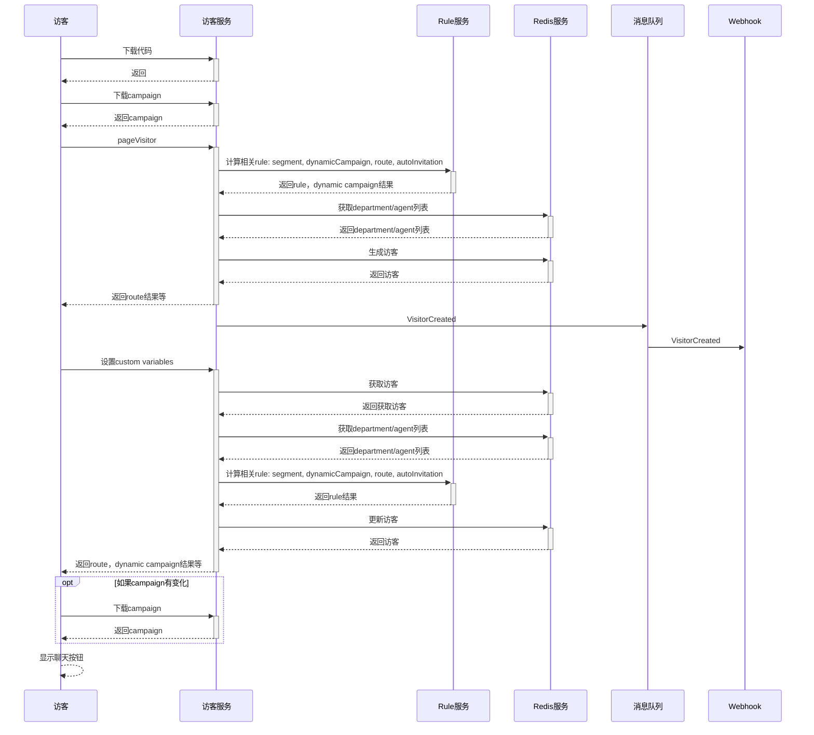
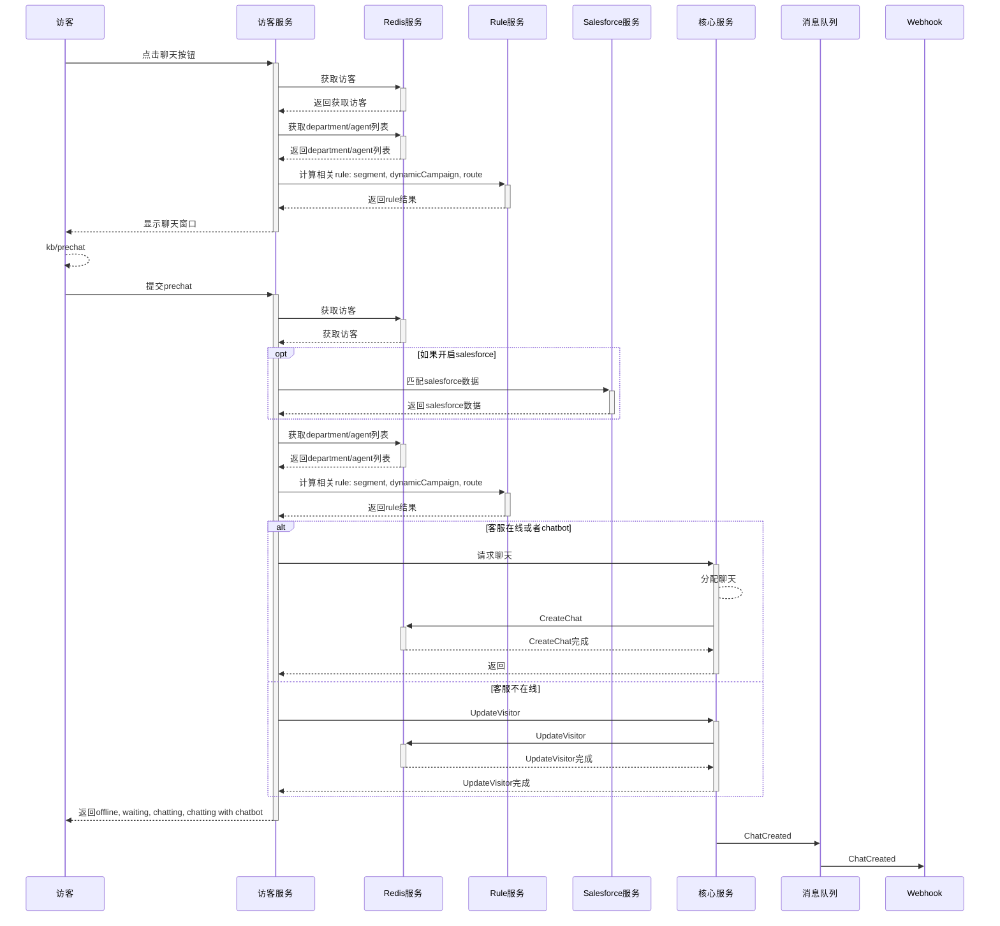
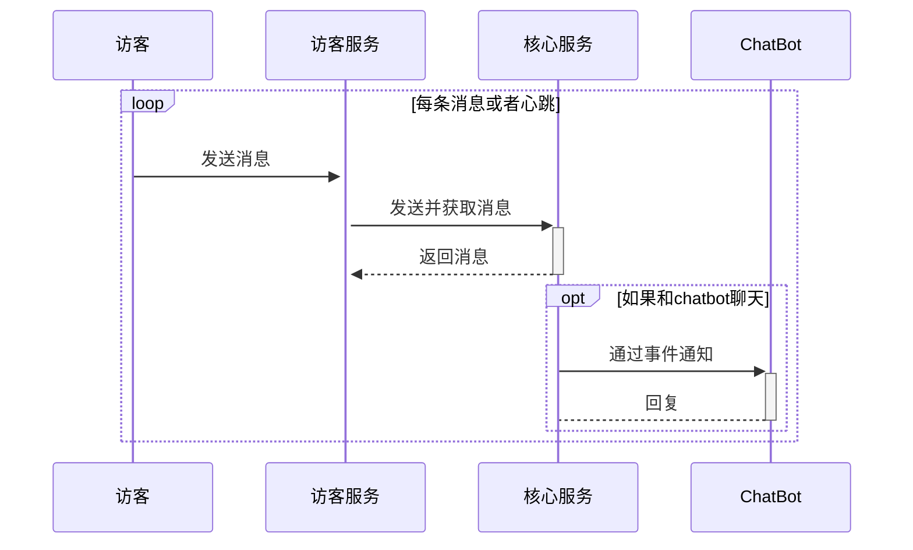
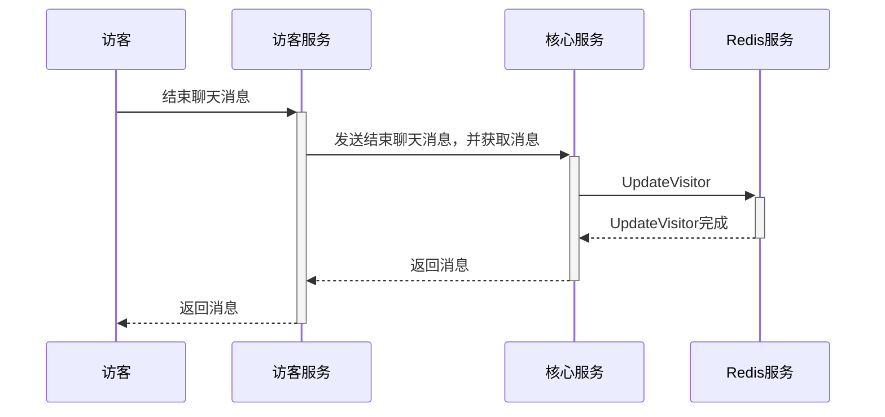
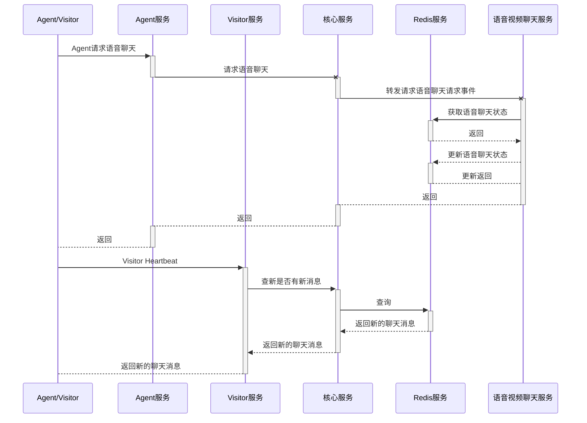

# Chat Server设计

## 案例

- 访客进站过程

- 访客打开聊天窗口并请求聊天

- 访客聊天过程

- 访客结束聊天过程

- 客服请求语音聊天，访客接受过程

- conversion

## Redis服务器接口列表

- CreateVisitor
- CreateChat
- CreateAgent
- RemoveVisitor
- RemoveChat
- RemoveAgent
- UpdateVisitor
- UpdateChat
  - SendChatMessage
- UpdateAgent
  - SendAgentMessage
- GetVisitors
  - 可以根据各种条件过滤，guid,site,status等等
- GetAgents
- GetChatMessages
- GetAgentMessages

### feedback
1. Pipeline, 可插拔
2. 事件定义的处理过程 - 
3. 模块发布升级 - loadbalance